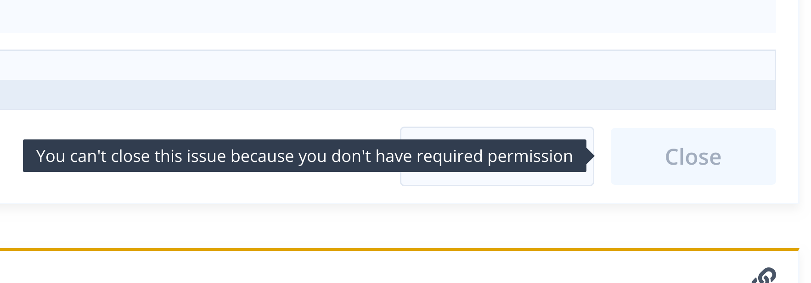

# Restricting access to Close button

Users with admin permissions for a repository can restrict closing issues only to users with admin permissions. By default, all users with write permissions can close issues. See also [Permissions](../getting-started/permissions.md).

After enabling the above option, the **Close** button will be disabled for all users without admin permissions, like the following:

